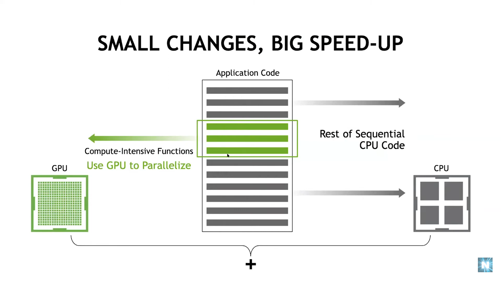

## Introduction to GPU Programming
---
### Introduction to NVIDIA GPU Programming
---
1. TODO: Rasterization concept: converts different shapes into pixels that can be computed simultaneously in parallel and redered in the screen.

- 
